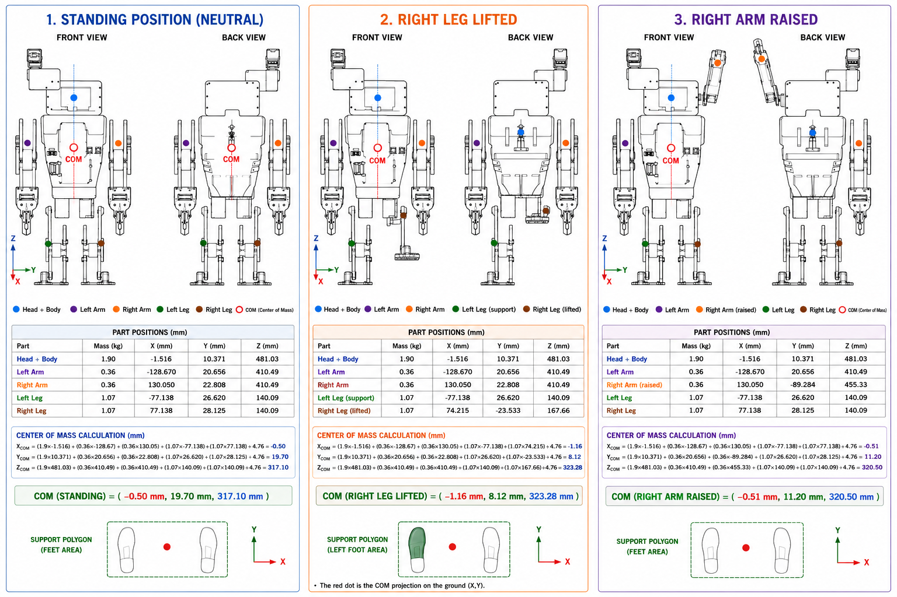

# Center of Mass Analysis

This section presents the center of mass analysis of the **Mitsos Open-Source AI Humanoid Robot**. The calculations were used to evaluate the robot’s static stability and how the mass distribution changes during different poses.

The analysis includes three configurations:

- **Standing position**
- **Right leg lifted**
- **Right arm raised**

  

## Mass Distribution

| Part | Mass |
|---|---:|
| Head + Body | 1.90 kg |
| Left Arm | 0.36 kg |
| Right Arm | 0.36 kg |
| Left Leg | 1.07 kg |
| Right Leg | 1.07 kg |
| **Total Calculated Mass** | **4.76 kg** |

> The measured robot weight is approximately **4.5 kg**.

## Center of Mass Formula

\[
X_{COM} = \frac{(m_1x_1) + (m_2x_2) + (m_3x_3) + (m_4x_4) + (m_5x_5)}{M}
\]

\[
Y_{COM} = \frac{(m_1y_1) + (m_2y_2) + (m_3y_3) + (m_4y_4) + (m_5y_5)}{M}
\]

\[
Z_{COM} = \frac{(m_1z_1) + (m_2z_2) + (m_3z_3) + (m_4z_4) + (m_5z_5)}{M}
\]

## Results

| Case | X_COM (mm) | Y_COM (mm) | Z_COM (mm) |
|---|---:|---:|---:|
| Standing Position | -0.50 | 19.70 | 317.10 |
| Right Leg Lifted | -1.16 | 8.12 | 323.28 |
| Right Arm Raised | -0.51 | 11.20 | 320.50 |

## Mechanical Conclusions

- The **X displacement** remains close to zero because the robot is approximately symmetric.
- **Leg movement** affects stability more than arm movement because the legs carry more mass.
- The **center of mass rises slightly** during dynamic movements.
- These results are useful for walking stability, torque estimation, and balance controller design.
