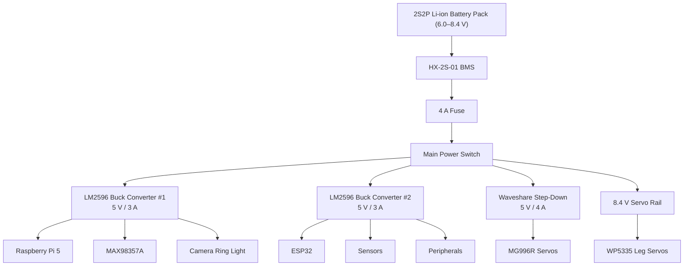

# Power Management

  

The system is powered by **four 18650 batteries**, consisting of **two parallel cell groups connected in series**, creating a **2S2P lithium-ion battery pack**.

By connecting **two batteries in parallel**, the battery capacity is doubled, increasing the overall runtime of the robot.

By connecting the **two parallel cell groups in series**, the maximum output voltage is doubled from **4.2 V** (a single Li-ion cell) to **8.4 V**, which is the recommended operating voltage for the **WP5335 servos** used in the robot's legs.

Following this, the batteries connect directly to an **HX-2S-01 Battery Management System (BMS)**, which protects the robot from:

- Short circuits
- Overcharge
- Over-discharge
- Over-current

Moreover, a **4 A fuse** and an **SPDT power switch** are connected to the battery output to safely turn the robot **ON/OFF** , ensuring that any short circuit cannot cause damage to the electronics.

A single **18650 lithium-ion cell** has a maximum voltage of **4.2 V** and an operating voltage of **3.6–3.7 V**. Therefore, **two cells connected in series (2S)** provide **8.4 V (fully charged)** to approximately **6.0 V (discharged)**.

Since several components of the robot require a regulated **5 V** supply, dedicated DC-DC step-down converters are used to convert the battery voltage to stable 5 V outputs.

### LM2596 Buck Converter #1

| Characteristic | Value |
|----------------|-------|
| **Input Voltage** | 6–40 V DC |
| **Output Voltage** | 5 V |
| **Maximum Output Current** | 3 A |

**Supplies:**
- Raspberry Pi 5
- MAX98357A Audio Amplifier
- Camera Ring Light

### LM2596 Buck Converter #2

| Characteristic | Value |
|----------------|-------|
| **Input Voltage** | 6–40 V DC |
| **Output Voltage** | 5 V |
| **Maximum Output Current** | 3 A |

**Supplies:**
- ESP32
- All ESP32 sensors
- ESP32 peripherals

### Waveshare DC-DC Step-Down Converter

| Characteristic | Value |
|----------------|-------|
| **Input Voltage** | 6–24 V DC |
| **Output Voltage** | 5 V |
| **Maximum Output Current** | 4 A |
| **Purpose** | High-current servo power supply |

**Supplies:**
- MG996R Servos

# Current Consumption

| Component | Voltage | Typical Current | Maximum Current |
|---|---|---|---|
| Raspberry Pi 5 | 5V | 1.5A | 5A |
| ESP32 | 5V / 3.3V | 100mA | 300mA |
| ToF Sensors | 3.3V | 120mA | 200mA |
| IMU | 3.3V | 10mA | 20mA |
| TFT Display | 5V | 150mA | 250mA |
| MAX98357A Audio Amplifier | 5V | 100mA | 500mA |
| MG996R Servo System | 5V | 2A | 8A |
| WP5335 Servo System | 6-8.4V (VBAT) | 3A | 15A+ |

> **Note:** Although the **WP5335 servos** can draw more than **15 A**, the robot is mechanically and electronically designed so that the servos never operate at stall torque. Consequently, the **4 A fuse** and the **8.4 V (VBAT) power rail** are sufficient for normal operation.
>
> The same principle applies to the **MG996R servos**. While their combined peak current can exceed **8 A**, the robot's mechanical design prevent them from reaching this level of consumption. Therefore, the **5 V / 4 A DC-DC step-down converter** is capable of supplying the required current during all intended operating conditions.
