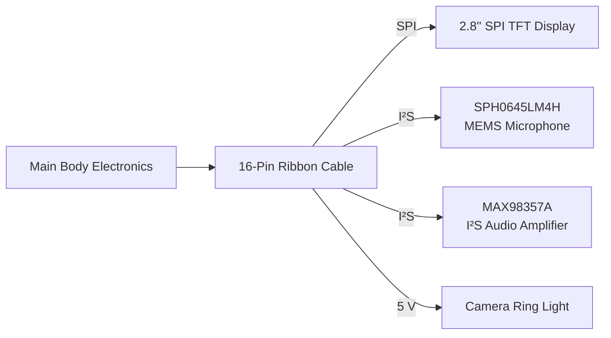

## Sensors Head

  

The **Head Electronics Board** integrates all of the components located inside the humanoid robot's head into a compact modular PCB. It provides the display interface, digital audio input and output, camera illumination, and communication with the main body through a **16-pin ribbon cable**.

# 2.8" SPI TFT Display

The robot uses a **2.8-inch SPI TFT LCD** with a resolution of **240 × 320 pixels** to display facial expressions and animations. The screen serves as the robot's face, allowing it to visually communicate emotions and user feedback. Since the display is driven directly by the Raspberry Pi 5 through the **SPI interface**, high frame rates can be achieved while keeping GPIO usage to a minimum.

### Specifications

| Parameter | Value |
|------------|-------|
| Display Size | 2.8 inches |
| Resolution | 240 × 320 pixels |
| Display Type | TFT LCD |
| Interface | SPI |
| Color Depth | 65K Colors |
| Driver IC | ILI9341 Compatible |
| Supply Voltage | 3.3 V |
| Logic Voltage | 3.3 V |
| Orientation | Portrait / Landscape |
| Primary Function | Robot facial expressions |

# MAX98357A Audio Amplifier

The **MAX98357A** is a digital **Class-D I²S audio amplifier** used to drive a **3 Ω speaker**. The Raspberry Pi sends digital audio over the I²S interface, allowing the robot to convert responses generated by its Large Language Model (LLM) into natural speech without requiring an external DAC.

### Specifications

| Parameter | Value |
|------------|-------|
| Device | MAX98357A |
| Amplifier Type | Class-D |
| Audio Interface | I²S |
| Output Power | Up to 3.2 W |
| Speaker Impedance | 3–8 Ω |
| Supply Voltage | 2.5–5.5 V |
| Efficiency | Up to 92% |
| Audio Output | Mono |
| Primary Function | Speech synthesis |

# SPH0645LM4H MEMS Microphone

The **SPH0645LM4H** is a digital MEMS microphone used for voice capture. Unlike traditional analog microphones, it outputs digital audio directly through the **I²S interface**, eliminating the need for an external analog-to-digital converter.

The microphone is used together with a **Speech-to-Text (STT)** model, enabling users to issue voice commands, ask questions, and interact naturally with the robot.

### Specifications

| Parameter | Value |
|------------|-------|
| Device | SPH0645LM4H |
| Microphone Type | Digital MEMS |
| Interface | I²S |
| Directionality | Omnidirectional |
| Frequency Response | 100 Hz – 10 kHz |
| Signal-to-Noise Ratio | 65 dB |
| Sensitivity | −26 dBFS |
| Supply Voltage | 1.62–3.6 V |
| Current Consumption | ~600 μA |
| Primary Function | Voice recognition |

---

# Camera Ring Light

A compact **5 V LED ring light** is mounted around the camera to provide a consistent illumination source under varying lighting conditions.The ring light significantly enhances the performance of computer vision algorithms such as object detection, face tracking, and pose estimation.

The LED ring is powered directly from the **5 V rail** through the ribbon cable and does not require additional communication interfaces.

# 16-Pin Ribbon Connector

The head PCB connects to the robot's main electronics through a **16-pin ribbon cable**, carrying SPI, I²S, power, and control signals between the Raspberry Pi 5 and all head-mounted peripherals.

This modular connection allows the complete head assembly—including the display, microphone, speaker, and lighting—to be removed without disconnecting individual wires.

| Signal Group | Purpose |
|---------------|---------|
| SPI | TFT Display |
| I²S | Audio Amplifier & MEMS Microphone |
| 3.3 V | Logic Power |
| 5 V | Ring Light & Audio Amplifier |
| GND | Common Ground |
| Reset | Display Reset |
| DC | Display Data / Command |
