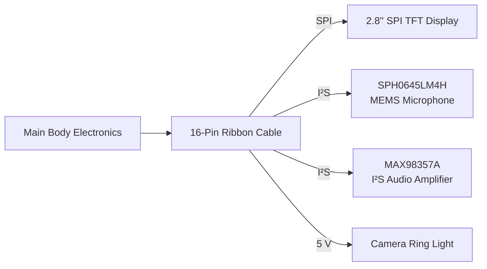

## Sensors Head

  

## 2.8" SPI TFT Display
The robot uses a **2.8-inch SPI TFT Display** with a resolution of **240x320 pixels** in order to show emotion. A variety of expressions can be shown via animations or images. The display is driven directly by the Raspberry Pi 5 through the SPI interface.

### Specifications

| Parameter | Value |
|------------|-------|
| Display Size | 2.8" |
| Resolution | 240 × 320 |
| Interface | SPI |
| Supply Voltage | 3.3 V |
| Purpose | Robot facial animations |

## MAX98357A Audio Amplifier

The **MAX98357A** is used with a 3Ω Speaker to output the LLM's text response into an audio making it easer for the user to understand and use the robot 

### Specifications

| Parameter | Value |
|------------|-------|
| Interface | I²S |
| Output Power | Up to 3.2 W |
| Supply Voltage | 2.5–5.5 V |
| Output | Mono Speaker |

---

## SPH0645LM4H MEMS Microphone

The robot uses a **SPH0645LM4H** digital MEMS microphone for voice capture. It is used in combitanoin of a STT(Speech-To-Text) model in order to give commands or ask questions to the robot 

### Specifications

| Parameter | Value |
|------------|-------|
| Type | Digital MEMS |
| Interface | I²S |
| Supply Voltage | 1.62–3.6 V |
| Directionality | Omnidirectional |
| Purpose | Voice input |

## Camera Ring Light

A compact **5 V LED ring light** is mounted around the camera to provide consistent illumination under varying lighting conditions, improving computer vision performance.

### Specifications

| Parameter | Value |
|------------|-------|
| Supply Voltage | 5 V |
| Purpose | Camera illumination |

# 16-Pin Ribbon Connector

The head PCB connects to the robot's main electronics through a **16-pin ribbon cable**, carrying SPI, I²S, power, and control signals.

| Signal Group | Purpose |
|---------------|---------|
| SPI | TFT Display |
| I²S | Audio Amplifier & MEMS Microphone |
| 3.3 V | Logic Power |
| 5 V | Ring Light & Audio Amplifier |
| GND | Common Ground |
| Reset | Display Reset |
| DC | Display Data/Command |

